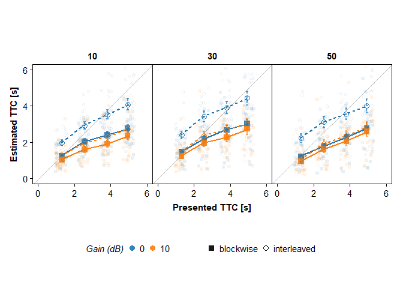
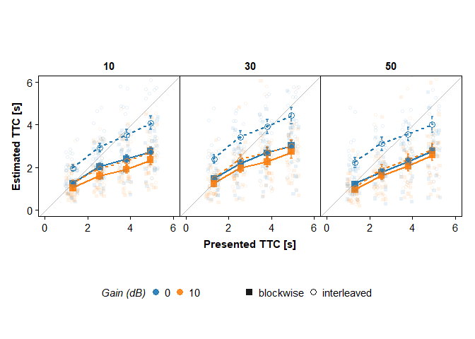

<!-- README.md is generated from README.Rmd. Please edit that file -->

# AGOtools

<!-- badges: start -->
<!-- badges: end -->

AGOtools is an R package providing some useful tools for the analysis of empirical data (plot themes for publication-ready plots using R's ggplot, outlier detection using a Tukey criterion, helper function for fitting psychomatric functions with the R package quickpsy etc.).
It is maintained by the work group of Prof. Dr. Daniel Oberfeld-Twistel (https://www.staff.uni-mainz.de/oberfeld/) at Johannes
Gutenberg-Universität Mainz, Germany.

## Project Status

This Project is currently under construction.

## Installation

Install AGOtools with:

    devtools::install_github("AGOberfeld/AGOtools")

## Dependencies

Before using AGOtools, make sure the right Quickpsy-version (dev-version
from Github, https://github.com/danilinares/quickpsy) is installed:

    devtools::install_github("danilinares/quickpsy")

If you have already installed the official version from CRAN, remove
quickpsy before installing it again from github.

    remove.packages("quickpsy")

    # install.packages("devtools")
    require(devtools)
    devtools::install_github("danilinares/quickpsy")

## Functions

### set_options

Sets the color palette of ggplots to default values. By default the
matplotlib colors are chosen. Also sets the number format for the R output and loads some default packages.

``` r
set_options()
```

### tukey

Adds variables to an input dataset (data) which indicate if
observations on a specified variable (dv) are outliers according to
a "nonparametric"  criterion proposed by John Tukey. Values of variable dv more than k*IQR (interquartile range) below the first quartile (25% quantile) 
or more than k*IQR above the third quartile (75% quantile) are flagged as outliers.
The argument tukey_crit can be used to modify the factor k (default = 3).


Identify outliers without excluding them:

``` r
tukey(data = loudness_block, 
      dv = Estimated_TTC, 
      tukey_crit=3, 
      exclude = FALSE)
#> # A tibble: 11,040 × 20
#>    Participantnr Condition Session_code Block Trialnr Velocity Car_label  GaindB
#>    <chr>             <int>        <int> <fct>   <int> <fct>    <chr>       <dbl>
#>  1 vp001                 1            1 1          24 50       Kia_v0_50…      0
#>  2 vp001                 1            1 1          25 50       Kia_v0_50…      0
#>  3 vp001                 1            1 1          26 10       Kia_v0_10…      0
#>  4 vp001                 1            1 1          27 30       Kia_v0_30…      0
#>  5 vp001                 1            1 1          28 10       Kia_v0_10…      0
#>  6 vp001                 1            1 1          29 10       Kia_v0_10…      0
#>  7 vp001                 1            1 1          30 30       Kia_v0_30…      0
#>  8 vp001                 1            1 1          31 30       Kia_v0_30…      0
#>  9 vp001                 1            1 1          32 10       Kia_v0_10…      0
#> 10 vp001                 1            1 1          33 30       Kia_v0_30…      0
#> # ℹ 11,030 more rows
#> # ℹ 12 more variables: gainBlock1 <dbl>, loudnessVariation <chr>, TTC <dbl>,
#> #   Estimated_TTC <dbl>, vOcc <dbl>, Estimated_TTC_trialsInSet <int>,
#> #   Estimated_TTC_IQR <dbl>, Estimated_TTC_Quant25 <dbl>,
#> #   Estimated_TTC_Quant75 <dbl>, Estimated_TTC_outlierTukeyLow <dbl>,
#> #   Estimated_TTC_outlierTukeyHigh <dbl>, Estimated_TTC_outlierTukey <dbl>
```

Identify outliers and exclude them:

``` r
loudness_block %>%
    tukey(Estimated_TTC, 
          exclude = TRUE)
#> # A tibble: 10,784 × 20
#>    Participantnr Condition Session_code Block Trialnr Velocity Car_label  GaindB
#>    <chr>             <int>        <int> <fct>   <int> <fct>    <chr>       <dbl>
#>  1 vp001                 1            1 1          24 50       Kia_v0_50…      0
#>  2 vp001                 1            1 1          27 30       Kia_v0_30…      0
#>  3 vp001                 1            1 1          28 10       Kia_v0_10…      0
#>  4 vp001                 1            1 1          32 10       Kia_v0_10…      0
#>  5 vp001                 1            1 1          33 30       Kia_v0_30…      0
#>  6 vp001                 1            1 1          34 30       Kia_v0_30…      0
#>  7 vp001                 1            1 1          36 10       Kia_v0_10…      0
#>  8 vp001                 1            1 1          37 10       Kia_v0_10…      0
#>  9 vp001                 1            1 1          38 50       Kia_v0_50…      0
#> 10 vp001                 1            1 1          39 50       Kia_v0_50…      0
#> # ℹ 10,774 more rows
#> # ℹ 12 more variables: gainBlock1 <dbl>, loudnessVariation <chr>, TTC <dbl>,
#> #   Estimated_TTC <dbl>, vOcc <dbl>, Estimated_TTC_trialsInSet <int>,
#> #   Estimated_TTC_IQR <dbl>, Estimated_TTC_Quant25 <dbl>,
#> #   Estimated_TTC_Quant75 <dbl>, Estimated_TTC_outlierTukeyLow <dbl>,
#> #   Estimated_TTC_outlierTukeyHigh <dbl>, Estimated_TTC_outlierTukey <dbl>
```

Returns a list of variables and adds them to the initial data set:

`trialsInSet` = total number of trials in the data set  
`IQR` = inter quantile range  
`Quant25` = 25% quantile  
`Quant75` = 75% quantile  
`outlierTukeyLow` = indicates if dv for a given trial is lower than the
tukey criterion (1) or not (0)  
`outlierTukeyHigh` = indicates if dv for a given trial is higher than
the tukey criterion (1) or not (0)  
`outlierTukey` = indicates if dv for a given trial exceeds the lower or
the higher criterion (1) or is within both criteria (0)

### tidyQuickPsy

This function is used to facilitate the analysis of psyhometric function fitted with quickpsy (https://github.com/danilinares/quickpsy).
Takes a quickpsy-object and turns it as a tibble.

Use the following arguments in the quickpsy function:  
`d` = data  
`x` = Name of the explanatory variable (e.g. TTC)  
`k` = Name of the variable containing the number of "positive" decisions per condition (= unique combination of the grouping variables) 
`n` = number of trials per condition (= unique combination of the grouping variables) 
`grouping` = concatenated vector of the variables that define the
experimental conditions to which separate psychometric functions are fit (e.g., vector containing the partipiant code variable and the variables defining separate expeirmental conditions)

``` r
data <- streetcrossing %>% 
  filter(vp_code == "vp0001")

qp <- quickpsy(d = data,  
                x = track_TTC, 
                k = nCross, 
                n = nTrials,  
                grouping = c("vp_code","modality","v0","a","label","gain"),  
                fun=cum_normal_fun,  
                guess=0,  
                lapses=0,  
                bootstrap = 'none')  

qp_tidy <- tidyQuickPsy(qp)

qp_tidy$tidy_fit %>% 
  head()
#> # A tibble: 6 × 20
#> # Groups:   vp_code, modality, v0, a, label, gain [6]
#>   vp_code modality    v0     a label    gain muEst sigmaEst se_muEst se_sigmaEst
#>   <chr>   <chr>    <dbl> <int> <chr>   <int> <dbl>    <dbl>    <dbl>       <dbl>
#> 1 vp0001  A         10       2 Kia_v0…     0  4.14    1.19     0.176       0.292
#> 2 vp0001  A         10       2 Kia_v0…    10  6.37    0.948    0.167       0.190
#> 3 vp0001  A         30       0 Kia_v0…     0  1.56    0.927    0.159       0.190
#> 4 vp0001  A         30       0 Kia_v0…    10  5.03    2.09     0.323       0.472
#> 5 vp0001  A         49.6     0 Kia_v0…     0  2.46    2.20     0.345       0.461
#> 6 vp0001  A         49.6     0 Kia_v0…    10  4.78    2.52     0.392       0.553
#> # ℹ 10 more variables: nTrials <int>, LLRtestvalue <dbl>, LLRtestDF <int>,
#> #   p_value <dbl>, LLRpValue <dbl>, LL <dbl>, nParFittedModel <int>,
#> #   LLsaturated <dbl>, nParSaturatedModel <int>, trialData <list>
```

tidyQuickPsy returns a list with two elements:  
- `qp_tidy$qp` is the “old” quickpsy object - `qp_tidy$tidy_fit` is a
tidy tibble containing the most important statistics of the quickpsy
object.

### plotQuickPsy

Takes an object produced by tidyQuickPsy and plots the resulting
psychometric functions for each person separately.

``` r
qp_tidy <- tidyQuickPsy(qp)

plotQuickPsy(qp_tidy)$plot_list[[1]]
```



<!-- If the hessian matrix for one participant is not solvable, quickpsy breaks. To prevent this, use `safe_quickpsy`: -->
<!-- ```{r} -->
<!-- qp_list <- safe_quickpsy(data = streetcrossing, -->
<!--               part_id = vp_code, -->
<!--               x = track_TTC, -->
<!--               k = nCross, -->
<!--               n = nTrials, -->
<!--               grouping = c("vp_code","modality","v0","a","label","gain")) -->
<!-- # tidy data and combine data sets from each participant: -->
<!-- tidy_qp_list <- map(qp_list,tidyQuickPsy) -->
<!-- map(tidy_qp_list,function(.x){return(.x$tidy_fit)}) %>%  -->
<!--   bind_rows() %>%  -->
<!--   head() -->
<!-- # only participant nr 1: -->
<!-- plot_list <- map(tidy_qp_list[1], plotQuickPsy) -->
<!-- # show only first plot: -->
<!-- plot_list$vp0001$plot_list[1] -->
<!-- ``` -->

### plotThemeAGO

Plot theme for publication-ready data plots

``` r
dat_clean <- loudness_block %>%
  tukey(Estimated_TTC, 
        exclude = T) %>% 
  mutate(TTC_as_factor = factor(TTC),
         Condition_text = str_c(GaindB," dB, ",loudnessVariation)) %>% 
  group_by(Participantnr, TTC, TTC_as_factor, Velocity, Condition_text, loudnessVariation, GaindB) %>% 
  summarise(mean_estTTC = mean(Estimated_TTC), 
            SD_estTTC = sd(Estimated_TTC),
            N_estTTC = n())
#> `summarise()` has grouped output by 'Participantnr', 'TTC', 'TTC_as_factor',
#> 'Velocity', 'Condition_text', 'loudnessVariation'. You can override using the
#> `.groups` argument.

sum_dat <- dat_clean %>%
   filter(Participantnr != "vp001") %>% 
   group_by(TTC, TTC_as_factor, Velocity, GaindB, loudnessVariation, Condition_text) %>%
   summarise(mean_estTTC_mean = mean(mean_estTTC), SD_estTTC_mean = sd(mean_estTTC)) 
#> `summarise()` has grouped output by 'TTC', 'TTC_as_factor', 'Velocity',
#> 'GaindB', 'loudnessVariation'. You can override using the `.groups` argument.

dat_clean %>%
  filter(Participantnr != "vp001") %>% 
  ggplot(aes(x = TTC, 
             y = mean_estTTC, 
             color = as.factor(GaindB),
             shape = as.factor(loudnessVariation), 
             linetype = as.factor(loudnessVariation)))+
  geom_abline(aes(intercept=0, slope =1), 
              color = "grey")+
  geom_line(data = sum_dat, 
            aes(x = TTC, 
                y = mean_estTTC_mean), 
            linewidth = 1, 
            show.legend = FALSE)+
  stat_summary_bin(fun.data = mean_se, 
                   geom = "errorbar", 
                   linewidth = 1, 
                   alpha = 0.7, 
                   show.legend = FALSE)+
  stat_summary_bin(fun = mean, 
                   geom = "point", 
                   alpha = 0.9,
                   size = 3, 
                   show.legend = TRUE)+
  geom_jitter(alpha = 0.1, 
              width = 0.3, 
              show.legend = FALSE)+
  coord_cartesian(xlim = c(0,6), 
                  ylim = c(0,6))+
  facet_wrap(vars(Velocity))+
  plotThemeAGO(base_size = 14)+
  labs(x = "Presented TTC [s]", 
       y = "Estimated TTC [s]", 
       colour = "Gain (dB)", 
       shape = "", 
       linetype="")+
  theme(aspect.ratio = 1)
```



### Data sets

``` r
data("loudness_block")
head(loudness_block)
#> # A tibble: 6 × 13
#>   Participantnr Condition Session_code Block Trialnr Velocity Car_label   GaindB
#>   <chr>             <int>        <int> <fct>   <int> <fct>    <chr>        <dbl>
#> 1 vp001                 1            1 1          24 50       Kia_v0_50_…      0
#> 2 vp001                 1            1 1          25 50       Kia_v0_50_…      0
#> 3 vp001                 1            1 1          26 10       Kia_v0_10_…      0
#> 4 vp001                 1            1 1          27 30       Kia_v0_30_…      0
#> 5 vp001                 1            1 1          28 10       Kia_v0_10_…      0
#> 6 vp001                 1            1 1          29 10       Kia_v0_10_…      0
#> # ℹ 5 more variables: gainBlock1 <dbl>, loudnessVariation <chr>, TTC <dbl>,
#> #   Estimated_TTC <dbl>, vOcc <dbl>

data("streetcrossing")
head(streetcrossing)
#> # A tibble: 6 × 10
#>   vp_code label        modality    v0     a  gain track_TTC nTrials nCross vp   
#>   <chr>   <chr>        <chr>    <dbl> <int> <int>     <dbl>   <int>  <int> <chr>
#> 1 vp0001  Kia_v0_10_r… A           10     2     0      2.86       6      0 Kia_…
#> 2 vp0001  Kia_v0_10_r… A           10     2     0      3          1      1 Kia_…
#> 3 vp0001  Kia_v0_10_r… A           10     2     0      3.29       6      2 Kia_…
#> 4 vp0001  Kia_v0_10_r… A           10     2     0      3.34       3      2 Kia_…
#> 5 vp0001  Kia_v0_10_r… A           10     2     0      3.78      10      1 Kia_…
#> 6 vp0001  Kia_v0_10_r… A           10     2     0      3.85      16      6 Kia_…
```
