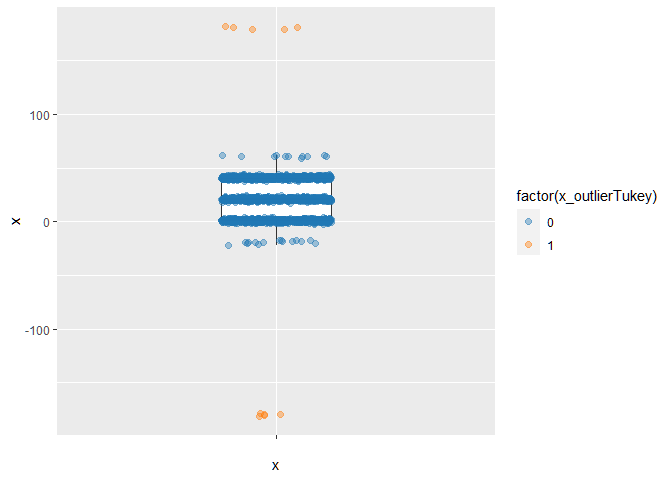
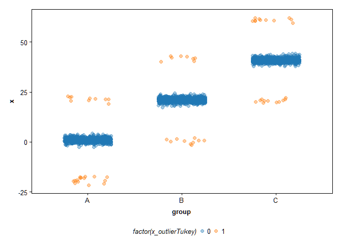
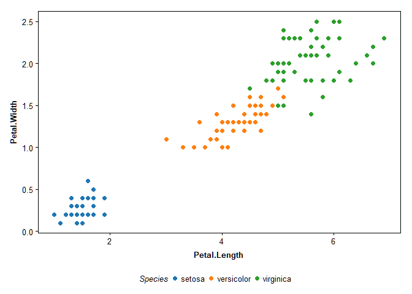

<!-- README.md is generated from README.Rmd. Please edit that file -->

# AGOtools

<!-- badges: start -->
<!-- badges: end -->

AGOtools is an R package providing some useful tools for the analysis of
empirical data (plot themes for publication-ready plots using R’s
ggplot, outlier detection using a Tukey criterion, helper functions for
fitting psychometric functions with the R package quickpsy
(<https://github.com/danilinares/quickpsy>) etc.).

## Project Status

This Project is currently under construction.

## Installation

Install AGOtools with:

    devtools::install_github("AGOberfeld/AGOtools")

## Dependencies

If you want to use the helper fuznctions for quickpsy, make sure the
correct Quickpsy-version (dev-version from Github,
<https://github.com/danilinares/quickpsy>) is installed:

    devtools::install_github("danilinares/quickpsy")

If you have already installed the official version from CRAN, remove
quickpsy before installing it again from github.

    remove.packages("quickpsy")

    # install.packages("devtools")
    require(devtools)
    devtools::install_github("danilinares/quickpsy")

## Functions

### set_options

Sets the color palette of ggplots to default values. By default the
matplotlib colors are chosen. Also sets the number format for the R
output and loads some default packages (e.g., `tidyverse`, `pracma`,
`extrafont`).

``` r
set_options()
#> Loading required package: pracma
#> 
#> Attaching package: 'pracma'
#> The following object is masked from 'package:purrr':
#> 
#>     cross
#> Loading required package: rlang
#> 
#> Attaching package: 'rlang'
#> The following objects are masked from 'package:purrr':
#> 
#>     %@%, flatten, flatten_chr, flatten_dbl, flatten_int, flatten_lgl,
#>     flatten_raw, invoke, splice
#> Loading required package: extrafont
#> Registering fonts with R
#> Loading required package: DeLuciatoR
```

### tukey

Adds variables to an input dataset (data) which indicate if observations
on a specified variable (dv) are outliers according to a “nonparametric”
criterion proposed by John Tukey. Values of variable dv more than
k`*`IQR (interquartile range) below the first quartile (25% quantile) or
more than k`*`IQR above the third quartile (75% quantile) are flagged as
outliers. The argument tukey_crit can be used to modify the factor k
(default: tukey_crit = 3).

Identify outliers without excluding them:

``` r
tukey(data = tukey_data , 
      dv = x, 
      tukey_crit=3, 
      exclude = FALSE)
# A tibble: 3,010 × 11
   group      x x_trialsInSet x_IQR x_Quant25 x_Quant75 x_Tukey_lower_limit x_Tukey_upper_limit x_outlierTukeyLow x_outlierTukeyHigh x_outlierTukey
   <chr>  <dbl>         <int> <dbl>     <dbl>     <dbl>               <dbl>               <dbl>             <dbl>              <dbl>          <dbl>
 1 A      0.810          3010  38.7      1.68      40.3               -114.                156.                 0                  0              0
 2 A     -0.813          3010  38.7      1.68      40.3               -114.                156.                 0                  0              0
 3 A     -0.393          3010  38.7      1.68      40.3               -114.                156.                 0                  0              0
 4 A      0.895          3010  38.7      1.68      40.3               -114.                156.                 0                  0              0
 5 A      1.73           3010  38.7      1.68      40.3               -114.                156.                 0                  0              0
 6 A      0.593          3010  38.7      1.68      40.3               -114.                156.                 0                  0              0
 7 A      0.846          3010  38.7      1.68      40.3               -114.                156.                 0                  0              0
 8 A      2.35           3010  38.7      1.68      40.3               -114.                156.                 0                  0              0
 9 A      0.871          3010  38.7      1.68      40.3               -114.                156.                 0                  0              0
10 A      1.16           3010  38.7      1.68      40.3               -114.                156.                 0                  0              0
# ℹ 3,000 more rows

tukey_data  %>% 
  tukey(x, exclude = FALSE) %>%
  ggplot(aes(y = x,x = ""))+
  geom_boxplot(width=0.3,
               outlier.shape = NA)+
  geom_jitter(aes(color = factor(x_outlierTukey)), 
              position = position_jitter(0.15), 
              alpha = 0.4)
```



Identify outliers and exclude them:

``` r
tukey_data  %>%
    tukey(x, exclude = TRUE)
# A tibble: 3,000 × 11
   group      x x_trialsInSet x_IQR x_Quant25 x_Quant75 x_Tukey_lower_limit x_Tukey_upper_limit x_outlierTukeyLow x_outlierTukeyHigh x_outlierTukey
   <chr>  <dbl>         <int> <dbl>     <dbl>     <dbl>               <dbl>               <dbl>             <dbl>              <dbl>          <dbl>
 1 A      0.810          3010  38.7      1.68      40.3               -114.                156.                 0                  0              0
 2 A     -0.813          3010  38.7      1.68      40.3               -114.                156.                 0                  0              0
 3 A     -0.393          3010  38.7      1.68      40.3               -114.                156.                 0                  0              0
 4 A      0.895          3010  38.7      1.68      40.3               -114.                156.                 0                  0              0
 5 A      1.73           3010  38.7      1.68      40.3               -114.                156.                 0                  0              0
 6 A      0.593          3010  38.7      1.68      40.3               -114.                156.                 0                  0              0
 7 A      0.846          3010  38.7      1.68      40.3               -114.                156.                 0                  0              0
 8 A      2.35           3010  38.7      1.68      40.3               -114.                156.                 0                  0              0
 9 A      0.871          3010  38.7      1.68      40.3               -114.                156.                 0                  0              0
10 A      1.16           3010  38.7      1.68      40.3               -114.                156.                 0                  0              0
# ℹ 2,990 more rows
```

Outlier exclusion groupwise:

``` r
tukey_data  %>% 
  group_by(group) %>% 
  tukey(x)
# A tibble: 3,010 × 11
# Groups:   group [5]
   group      x x_trialsInSet x_IQR x_Quant25 x_Quant75 x_Tukey_lower_limit x_Tukey_upper_limit x_outlierTukeyLow x_outlierTukeyHigh x_outlierTukey
   <chr>  <dbl>         <int> <dbl>     <dbl>     <dbl>               <dbl>               <dbl>             <dbl>              <dbl>          <dbl>
 1 A      0.810          1000  1.44     0.275      1.71               -4.04                6.03                 0                  0              0
 2 A     -0.813          1000  1.44     0.275      1.71               -4.04                6.03                 0                  0              0
 3 A     -0.393          1000  1.44     0.275      1.71               -4.04                6.03                 0                  0              0
 4 A      0.895          1000  1.44     0.275      1.71               -4.04                6.03                 0                  0              0
 5 A      1.73           1000  1.44     0.275      1.71               -4.04                6.03                 0                  0              0
 6 A      0.593          1000  1.44     0.275      1.71               -4.04                6.03                 0                  0              0
 7 A      0.846          1000  1.44     0.275      1.71               -4.04                6.03                 0                  0              0
 8 A      2.35           1000  1.44     0.275      1.71               -4.04                6.03                 0                  0              0
 9 A      0.871          1000  1.44     0.275      1.71               -4.04                6.03                 0                  0              0
10 A      1.16           1000  1.44     0.275      1.71               -4.04                6.03                 0                  0              0
# ℹ 3,000 more rows

tukey_data  %>% 
  filter(group %in% c("A","B","C")) %>% 
  group_by(group) %>% 
  tukey(x, 
          exclude = FALSE) %>%
  ggplot()+
  geom_jitter(aes(x = group, y = x, color = factor(x_outlierTukey)), alpha = 0.4, position = position_jitter(0.25))+
  plotThemeAGO()
```



Returns a list of variables and adds them to the initial data set:

`trialsInSet` = number of trials in the subset of trials for which the
outlier detection is run  
`IQR` = inter-quartile range  
`Quant25` = 25% quantile  
`Quant75` = 75% quantile  
`outlierTukeyLow` = indicates whether the value of dv on a given trial
is lower than Tukey_lower_limit (25% quantile minus tukey_crit\* IQR)
(1) or not (0)  
`outlierTukeyHigh` = indicates whether the value of dv on a given trial
is higher than Tukey_upper_limit (75% quantile plus tukey_crit\* IQR)
(1) or not (0)  
`outlierTukey` = indicates if dv for a given trial exceeds the lower or
the higher criterion (1) or is within both criteria (0)  
`Tukey_lower_limit` = highest value above which values are excluded  
`Tukey_upper_limit` = lowest value below which values are excluded

### tidyQuickPsy

This function is used to facilitate the analysis of psychometric
functions fitted with quickpsy
(<https://github.com/danilinares/quickpsy>).

Takes a quickpsy-object and turns it as a tibble.

Use the following arguments in the quickpsy function:  
`d` = data  
`x` = Name of the explanatory variable (e.g. TTC)  
`k` = Name of the variable containing the number of “positive” decisions
per group (= unique combination of the grouping variables) `n` = Name of
the variable containing the number of trials per group (= unique
combination of the grouping variables) `grouping` = concatenated vector
of the variables that define the groups of trials (i.e., rows in the
input dataset) to which separate psychometric functions are fit (e.g., a
vector containing the participant code variable and the variables
defining separate experimental conditions)

``` r
data <- streetcrossing %>% 
  filter(vp_code == "vp0001")

qp <- quickpsy(d = data,  
                x = track_TTC, 
                k = nCross, 
                n = nTrials,  
                grouping = c("vp_code","modality","v0","a","label","gain"),  
                fun=cum_normal_fun,  
                guess=0,  
                lapses=0,  
                bootstrap = 'none')  

qp_tidy <- tidyQuickPsy(qp)
Error in `pivot_wider()`:
! Can't subset columns that don't exist.
✖ Column `parinf` doesn't exist.

qp_tidy$tidy_fit %>% 
  head()
Error in eval(expr, envir, enclos): object 'qp_tidy' not found
```

tidyQuickPsy returns a list with two elements:  
- `qp_tidy$qp` is the “old” quickpsy object - `qp_tidy$tidy_fit` is a
tidy tibble containing the most important statistics of the quickpsy
object.

### plotQuickPsy

Takes an object produced by tidyQuickPsy and plots the resulting
psychometric functions for each person separately.

``` r
qp_tidy <- tidyQuickPsy(qp)
Error in `pivot_wider()`:
! Can't subset columns that don't exist.
✖ Column `parinf` doesn't exist.

plotQuickPsy(qp_tidy)$plot_list[[1]]
Error in eval(expr, envir, enclos): object 'qp_tidy' not found
```

If the hessian matrix for one participant is not solvable, use this
workaround to loop through all participant-condition combinations:

``` r
# load data
data <- streetcrossing

# split by conditions and participant ID
data_list <- data %>% 
  group_split(vp_code,modality,v0,a,label,gain)

qp_list <- list()
df_list <- list()

# safe quickpsy execution
for(i in seq_along(data_list)){
  qp_list[[i]] <- tryCatch(tidyQuickPsy(quickpsy(d = data_list[[i]],
                           x = track_TTC,
                           k = nCross,
                           n = nTrials,
                           grouping = c("vp_code","modality","v0","a","label","gain"),
                           bootstrap = 'none')),
                           
                           warning = function(w){print(w)},
                           
                           error = function(e){e},
                           
                           finally = "finished")
  
  # tidy dfs
  df_list[[i]] <- qp_list[[i]]$tidy_fit
  
  status_message <- paste(round(i/length(data_list),4)*100,"% completed")
  print(status_message)
  if(rlang::is_error(qp_list[[i]])){
    print(paste("Error in data_list-element Nr.",i))
  }
}

# Filter List for errors
qp_list_clean <- qp_list[!sapply(qp_list, rlang::is_error)]
df_list_clean <- df_list[!sapply(df_list, rlang::is_error)]

# row bind data frame

df <- df_list_clean %>% 
  bind_rows()

# plot list

plot_list <- list()

for(i in seq_along(qp_list_clean)){
  plot_list[[i]] <- plotQuickPsy(qp_list_clean[[i]])$plot_list[[1]]

  status_message <- paste(round(i/length(qp_list_clean),2)*100,"% completed")
  print(status_message)
}
```

### plotThemeAGO

Plot theme for publication-ready data plots.

``` r
ggplot(iris, aes(x = Petal.Length, y = Petal.Width, color = Species))+
  geom_point()+
  plotThemeAGO()
```



### Data sets

``` r
data("loudness_block")
head(loudness_block)
# A tibble: 6 × 13
  Participantnr Condition Session_code Block Trialnr Velocity Car_label                          GaindB gainBlock1 loudnessVariation   TTC Estimated_TTC  vOcc
  <chr>             <int>        <int> <fct>   <int> <fct>    <chr>                               <dbl>      <dbl> <chr>             <dbl>         <dbl> <dbl>
1 vp001                 1            1 1          24 50       Kia_v0_50_r0_0_a_0_i_73_2019_04_16      0          0 blockwise          2.5           3.94 14.0 
2 vp001                 1            1 1          25 50       Kia_v0_50_r0_0_a_0_i_73_2019_04_16      0          0 blockwise          5            17.2  13.9 
3 vp001                 1            1 1          26 10       Kia_v0_10_r0_0_a_0_i_31_2019_04_16      0          0 blockwise          5             9.97  2.94
4 vp001                 1            1 1          27 30       Kia_v0_30_r0_0_a_0_i_57_2019_04_16      0          0 blockwise          1.25          3.71  8.49
5 vp001                 1            1 1          28 10       Kia_v0_10_r0_0_a_0_i_31_2019_04_16      0          0 blockwise          2.5           7.27  2.94
6 vp001                 1            1 1          29 10       Kia_v0_10_r0_0_a_0_i_31_2019_04_16      0          0 blockwise          2.5           9.85  2.94

data("streetcrossing")
head(streetcrossing)
# A tibble: 6 × 10
  vp_code label                                modality    v0     a  gain track_TTC nTrials nCross vp                                  
  <chr>   <chr>                                <chr>    <dbl> <int> <int>     <dbl>   <int>  <int> <chr>                               
1 vp0001  Kia_v0_10_r0_60_a_20_i_11_2019_04_15 A           10     2     0      2.86       6      0 Kia_v0_10_r0_60_a_20_i_11_2019_04_15
2 vp0001  Kia_v0_10_r0_60_a_20_i_11_2019_04_15 A           10     2     0      3          1      1 Kia_v0_10_r0_60_a_20_i_11_2019_04_15
3 vp0001  Kia_v0_10_r0_60_a_20_i_11_2019_04_15 A           10     2     0      3.29       6      2 Kia_v0_10_r0_60_a_20_i_11_2019_04_15
4 vp0001  Kia_v0_10_r0_60_a_20_i_11_2019_04_15 A           10     2     0      3.34       3      2 Kia_v0_10_r0_60_a_20_i_11_2019_04_15
5 vp0001  Kia_v0_10_r0_60_a_20_i_11_2019_04_15 A           10     2     0      3.78      10      1 Kia_v0_10_r0_60_a_20_i_11_2019_04_15
6 vp0001  Kia_v0_10_r0_60_a_20_i_11_2019_04_15 A           10     2     0      3.85      16      6 Kia_v0_10_r0_60_a_20_i_11_2019_04_15
```
