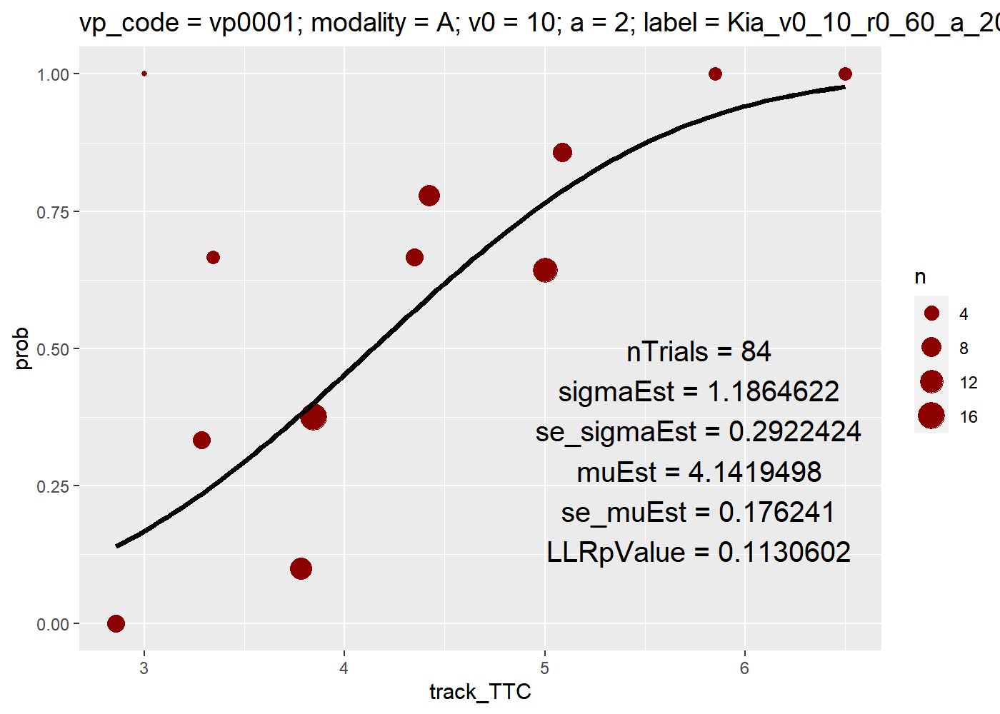

<!-- README.md is generated from README.Rmd. Please edit that file -->

# AGOtools

<!-- badges: start -->
<!-- badges: end -->

AGOtools is an R package providing some useful tools for the
experimental research on Time-To-Collision (TTC) estimation in traffic
contexts. It is built by the Arbeitsgruppe Oberfeld from Johannes
Gutenberg-Universität Mainz, Germany.

## Project Status

This Project is currently under construction.

## Installation

Install AGOtools with:

    devtools::install_github("AGOberfeld/AGOtools")

## Dependencies

Before using AGOtools, make sure the right Quickpsy-version (dev-version
from github) is installed:

    devtools::install_github("danilinares/quickpsy")

If you have already installed the official version from CRAN, remove
quickpsy before installing it again from github.

    remove.packages("quickpsy")

    # install.packages("devtools")
    require(devtools)
    devtools::install_github("danilinares/quickpsy")

## Functions

### set_options

Sets the color palette of ggplots to default values. By default the
matplotlib colors are chosen.

``` r
set_options()
#> Lade nötiges Paket: pracma
#> 
#> Attache Paket: 'pracma'
#> Das folgende Objekt ist maskiert 'package:purrr':
#> 
#>     cross
#> Lade nötiges Paket: rlang
#> 
#> Attache Paket: 'rlang'
#> Die folgenden Objekte sind maskiert von 'package:purrr':
#> 
#>     %@%, flatten, flatten_chr, flatten_dbl, flatten_int, flatten_lgl,
#>     flatten_raw, invoke, splice
#> Lade nötiges Paket: extrafont
#> Registering fonts with R
```

### tukey

Adds variables to a given dataset (data) which indicate if
oberservations on a specified variable (dv) are outliers according to
the tukey criterion.

The argument tukey_crit can be used to modify the factor of the inter
quantile range (default = 3).

Identify outliers without excluding them:

    # A tibble: 11,040 × 22
       Participantnr Condition Session_code Block Trialnr Velocity Car_label         GaindB gainBlock1 loudnessVariation   TTC Estimated_TTC  vOcc Estimated_TTC_trials…¹ Estimated_TTC_IQR Estimated_TTC_Quant25 Estimated_TTC_Quant75 Estimated_TTC_Tukey_…²
       <chr>             <int>        <int> <fct>   <int> <fct>    <chr>              <dbl>      <dbl> <chr>             <dbl>         <dbl> <dbl>                  <int>             <dbl>                 <dbl>                 <dbl>                  <dbl>
     1 vp001                 1            1 1          24 50       Kia_v0_50_r0_0_a…      0          0 blockwise          2.5           3.94 14.0                   11040              2.03                  1.25                  3.29                  -4.84
     2 vp001                 1            1 1          25 50       Kia_v0_50_r0_0_a…      0          0 blockwise          5            17.2  13.9                   11040              2.03                  1.25                  3.29                  -4.84
     3 vp001                 1            1 1          26 10       Kia_v0_10_r0_0_a…      0          0 blockwise          5             9.97  2.94                  11040              2.03                  1.25                  3.29                  -4.84
     4 vp001                 1            1 1          27 30       Kia_v0_30_r0_0_a…      0          0 blockwise          1.25          3.71  8.49                  11040              2.03                  1.25                  3.29                  -4.84
     5 vp001                 1            1 1          28 10       Kia_v0_10_r0_0_a…      0          0 blockwise          2.5           7.27  2.94                  11040              2.03                  1.25                  3.29                  -4.84
     6 vp001                 1            1 1          29 10       Kia_v0_10_r0_0_a…      0          0 blockwise          2.5           9.85  2.94                  11040              2.03                  1.25                  3.29                  -4.84
     7 vp001                 1            1 1          30 30       Kia_v0_30_r0_0_a…      0          0 blockwise          2.5          15.4   8.23                  11040              2.03                  1.25                  3.29                  -4.84
     8 vp001                 1            1 1          31 30       Kia_v0_30_r0_0_a…      0          0 blockwise          5            12.4   8.49                  11040              2.03                  1.25                  3.29                  -4.84
     9 vp001                 1            1 1          32 10       Kia_v0_10_r0_0_a…      0          0 blockwise          5             5.00  2.90                  11040              2.03                  1.25                  3.29                  -4.84
    10 vp001                 1            1 1          33 30       Kia_v0_30_r0_0_a…      0          0 blockwise          2.5           7.73  8.45                  11040              2.03                  1.25                  3.29                  -4.84
    # ℹ 11,030 more rows
    # ℹ abbreviated names: ¹​Estimated_TTC_trialsInSet, ²​Estimated_TTC_Tukey_lower_limit
    # ℹ 4 more variables: Estimated_TTC_Tukey_upper_limit <dbl>, Estimated_TTC_outlierTukeyLow <dbl>, Estimated_TTC_outlierTukeyHigh <dbl>, Estimated_TTC_outlierTukey <dbl>

Identify outliers and exclude them:

    # A tibble: 10,784 × 22
       Participantnr Condition Session_code Block Trialnr Velocity Car_label         GaindB gainBlock1 loudnessVariation   TTC Estimated_TTC  vOcc Estimated_TTC_trials…¹ Estimated_TTC_IQR Estimated_TTC_Quant25 Estimated_TTC_Quant75 Estimated_TTC_Tukey_…²
       <chr>             <int>        <int> <fct>   <int> <fct>    <chr>              <dbl>      <dbl> <chr>             <dbl>         <dbl> <dbl>                  <int>             <dbl>                 <dbl>                 <dbl>                  <dbl>
     1 vp001                 1            1 1          24 50       Kia_v0_50_r0_0_a…      0          0 blockwise          2.5           3.94 14.0                   11040              2.03                  1.25                  3.29                  -4.84
     2 vp001                 1            1 1          27 30       Kia_v0_30_r0_0_a…      0          0 blockwise          1.25          3.71  8.49                  11040              2.03                  1.25                  3.29                  -4.84
     3 vp001                 1            1 1          28 10       Kia_v0_10_r0_0_a…      0          0 blockwise          2.5           7.27  2.94                  11040              2.03                  1.25                  3.29                  -4.84
     4 vp001                 1            1 1          32 10       Kia_v0_10_r0_0_a…      0          0 blockwise          5             5.00  2.90                  11040              2.03                  1.25                  3.29                  -4.84
     5 vp001                 1            1 1          33 30       Kia_v0_30_r0_0_a…      0          0 blockwise          2.5           7.73  8.45                  11040              2.03                  1.25                  3.29                  -4.84
     6 vp001                 1            1 1          34 30       Kia_v0_30_r0_0_a…      0          0 blockwise          3.75          7.63  8.50                  11040              2.03                  1.25                  3.29                  -4.84
     7 vp001                 1            1 1          36 10       Kia_v0_10_r0_0_a…      0          0 blockwise          1.25          2.19  2.92                  11040              2.03                  1.25                  3.29                  -4.84
     8 vp001                 1            1 1          37 10       Kia_v0_10_r0_0_a…      0          0 blockwise          5             6.39  2.94                  11040              2.03                  1.25                  3.29                  -4.84
     9 vp001                 1            1 1          38 50       Kia_v0_50_r0_0_a…      0          0 blockwise          5             8.15 13.9                   11040              2.03                  1.25                  3.29                  -4.84
    10 vp001                 1            1 1          39 50       Kia_v0_50_r0_0_a…      0          0 blockwise          2.5           3.11 13.9                   11040              2.03                  1.25                  3.29                  -4.84
    # ℹ 10,774 more rows
    # ℹ abbreviated names: ¹​Estimated_TTC_trialsInSet, ²​Estimated_TTC_Tukey_lower_limit
    # ℹ 4 more variables: Estimated_TTC_Tukey_upper_limit <dbl>, Estimated_TTC_outlierTukeyLow <dbl>, Estimated_TTC_outlierTukeyHigh <dbl>, Estimated_TTC_outlierTukey <dbl>

Returns a list of variables and adds them to the initial data set:

`trialsInSet` = total number of trials in the data set  
`IQR` = inter quantile range  
`Quant25` = 25% quantile  
`Quant75` = 75% quantile  
`outlierTukeyLow` = indicates if dv for a given trial is lower than the
tukey criterion (1) or not (0)  
`outlierTukeyHigh` = indicates if dv for a given trial is higher than
the tukey criterion (1) or not (0)  
`outlierTukey` = indicates if dv for a given trial exceeds the lower or
the higher criterion (1) or is within both criteria (0)

### tidyQuickPsy

Takes a quickpsy-object and turns it into a tibble.

Use the following arguments in the quickpsy function:  
`d` = data  
`x` = Name of the explanatory variable (e.g. TTC)  
`k` = Name of the response variable.  
`n` = number of trials  
`grouping` = concatinated vector of the variables that define the
experimental conditions + partipiant code variable

    # A tibble: 6 × 20
    # Groups:   vp_code, modality, v0, a, label, gain [6]
      vp_code modality    v0     a label                                 gain muEst sigmaEst se_muEst se_sigmaEst nTrials LLRtestvalue LLRtestDF p_value LLRpValue     LL nParFittedModel LLsaturated nParSaturatedModel trialData        
      <chr>   <chr>    <dbl> <int> <chr>                                <int> <dbl>    <dbl>    <dbl>       <dbl>   <int>        <dbl>     <int>   <dbl>     <dbl>  <dbl>           <int>       <dbl>              <int> <list>           
    1 vp0001  A         10       2 Kia_v0_10_r0_60_a_20_i_11_2019_04_15     0  4.14    1.19     0.176       0.292      84        15.6         10  0.113     0.113  -17.0                2       -9.21                 12 <tibble [12 × 6]>
    2 vp0001  A         10       2 Kia_v0_10_r0_60_a_20_i_11_2019_04_15    10  6.37    0.948    0.167       0.190      80         2.62         6  0.854     0.854   -6.65               2       -5.34                  8 <tibble [8 × 6]> 
    3 vp0001  A         30       0 Kia_v0_30_r0_0_a_0_i_57_2019_04_16       0  1.56    0.927    0.159       0.190      81        17.3         14  0.238     0.238  -16.7                2       -8.06                 16 <tibble [16 × 6]>
    4 vp0001  A         30       0 Kia_v0_30_r0_0_a_0_i_57_2019_04_16      10  5.03    2.09     0.323       0.472      83        17.3         10  0.0687    0.0687 -17.2                2       -8.53                 12 <tibble [12 × 6]>
    5 vp0001  A         49.6     0 Kia_v0_50_r0_0_a_0_i_73_2019_04_16       0  2.46    2.20     0.345       0.461      83        24.0         18  0.156     0.156  -21.5                2       -9.52                 20 <tibble [20 × 6]>
    6 vp0001  A         49.6     0 Kia_v0_50_r0_0_a_0_i_73_2019_04_16      10  4.78    2.52     0.392       0.553      82         9.62        13  0.725     0.725  -15.3                2      -10.5                  15 <tibble [15 × 6]>

tidyQuickPsy returns a list with two elements:  
- `qp_tidy$qp` is the “old” quickpsy object - `qp_tidy$tidy_fit` is a
tidy tibble containing the most important statistics of the quickpsy
object.

### plotQuickPsy

Takes an object produced by tidyQuickPsy and plots the resulting
psychometric functions for each person separately.


<!-- If the hessian matrix for one participant is not solvable, quickpsy breaks. To prevent this, use `safe_quickpsy`: -->
<!-- ```{r} -->
<!-- qp_list <- safe_quickpsy(data = streetcrossing, -->
<!--               part_id = vp_code, -->
<!--               x = track_TTC, -->
<!--               k = nCross, -->
<!--               n = nTrials, -->
<!--               grouping = c("vp_code","modality","v0","a","label","gain")) -->
<!-- # tidy data and combine data sets from each participant: -->
<!-- tidy_qp_list <- map(qp_list,tidyQuickPsy) -->
<!-- map(tidy_qp_list,function(.x){return(.x$tidy_fit)}) %>%  -->
<!--   bind_rows() %>%  -->
<!--   head() -->
<!-- # only participant nr 1: -->
<!-- plot_list <- map(tidy_qp_list[1], plotQuickPsy) -->
<!-- # show only first plot: -->
<!-- plot_list$vp0001$plot_list[1] -->
<!-- ``` -->

### plotThemeAGO

Application of the plot theme using the iris data set.



### Data sets

    # A tibble: 6 × 13
      Participantnr Condition Session_code Block Trialnr Velocity Car_label                          GaindB gainBlock1 loudnessVariation   TTC Estimated_TTC  vOcc
      <chr>             <int>        <int> <fct>   <int> <fct>    <chr>                               <dbl>      <dbl> <chr>             <dbl>         <dbl> <dbl>
    1 vp001                 1            1 1          24 50       Kia_v0_50_r0_0_a_0_i_73_2019_04_16      0          0 blockwise          2.5           3.94 14.0 
    2 vp001                 1            1 1          25 50       Kia_v0_50_r0_0_a_0_i_73_2019_04_16      0          0 blockwise          5            17.2  13.9 
    3 vp001                 1            1 1          26 10       Kia_v0_10_r0_0_a_0_i_31_2019_04_16      0          0 blockwise          5             9.97  2.94
    4 vp001                 1            1 1          27 30       Kia_v0_30_r0_0_a_0_i_57_2019_04_16      0          0 blockwise          1.25          3.71  8.49
    5 vp001                 1            1 1          28 10       Kia_v0_10_r0_0_a_0_i_31_2019_04_16      0          0 blockwise          2.5           7.27  2.94
    6 vp001                 1            1 1          29 10       Kia_v0_10_r0_0_a_0_i_31_2019_04_16      0          0 blockwise          2.5           9.85  2.94
    # A tibble: 6 × 10
      vp_code label                                modality    v0     a  gain track_TTC nTrials nCross vp                                  
      <chr>   <chr>                                <chr>    <dbl> <int> <int>     <dbl>   <int>  <int> <chr>                               
    1 vp0001  Kia_v0_10_r0_60_a_20_i_11_2019_04_15 A           10     2     0      2.86       6      0 Kia_v0_10_r0_60_a_20_i_11_2019_04_15
    2 vp0001  Kia_v0_10_r0_60_a_20_i_11_2019_04_15 A           10     2     0      3          1      1 Kia_v0_10_r0_60_a_20_i_11_2019_04_15
    3 vp0001  Kia_v0_10_r0_60_a_20_i_11_2019_04_15 A           10     2     0      3.29       6      2 Kia_v0_10_r0_60_a_20_i_11_2019_04_15
    4 vp0001  Kia_v0_10_r0_60_a_20_i_11_2019_04_15 A           10     2     0      3.34       3      2 Kia_v0_10_r0_60_a_20_i_11_2019_04_15
    5 vp0001  Kia_v0_10_r0_60_a_20_i_11_2019_04_15 A           10     2     0      3.78      10      1 Kia_v0_10_r0_60_a_20_i_11_2019_04_15
    6 vp0001  Kia_v0_10_r0_60_a_20_i_11_2019_04_15 A           10     2     0      3.85      16      6 Kia_v0_10_r0_60_a_20_i_11_2019_04_15
